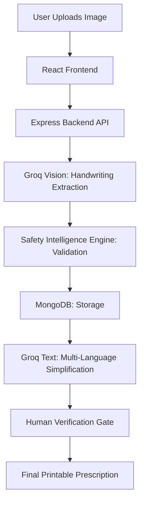

# 🏥 Prescripto

### Intelligent Doctor Handwriting Interpretation & Patient-Friendly Prescription System

[](https://vitejs.dev/)
[](https://react.dev/)
[](https://nodejs.org/)
[](https://www.mongodb.com/)
[](https://expressjs.com/)

> Built at **GHRHack 2.0** — 30-Hour National Hackathon | Jalgaon, Maharashtra | Feb 28 – Mar 1, 2026

---

## 🎯 The Problem

Every year, **1.5 lakh deaths** occur in India due to medication errors. The primary culprit is **illegible doctor handwriting**, which leads to:

- Patients being unable to read their own prescriptions.
- Pharmacists misinterpreting dosage and frequency.
- Lack of validation for extracted medical data.
- No patient-friendly explanation in local languages.

**Prescripto solves this by providing a multi-layered verification and simplification system.**

---

## 💡 What Makes Prescripto Different?

Prescripto is more than an OCR tool. It's a comprehensive safety system:

| Layer | Function |
|---|---|
| 🤖 **AI Vision Layer** | Uses Llama 4 Scout Vision to extract structured JSON from handwritten images. |
| 🛡️ **Safety Intelligence Engine** | A non-AI, rule-based engine that validates data for risks and safety scores. |
| ✅ **Human Verification Gate** | Forces a human review before any prescription is finalized. |
| 🌐 **Local Language Support** | Simplifies instructions into English, Hindi, and Marathi. |

---

## 🏗️ System Architecture



---

## 🛠️ Tech Stack

| Component | Technology |
|---|---|
| **Frontend** | React 18, Tailwind CSS, Vite |
| **Backend** | Node.js 20, Express 4 |
| **Database** | MongoDB Atlas, Mongoose |
| **AI (Vision)** | Groq Llama 4 Scout Vision |
| **AI (Text)** | Groq LLaMA 3.3 70B |
| **Deployment** | Vercel (FE) & Render (BE) |

---

## 🛡️ Safety Intelligence Engine

The core differentiator. Written entirely in pure Node.js — zero AI hallucinations, zero external libraries.

| Rule | Trigger | Severity | Score Impact |
|---|---|---|---|
| **EMPTY_EXTRACTION** | No medicines found | CRITICAL | -30 |
| **MISSING_NAME** | Medicine name is empty | CRITICAL | -30 |
| **MISSING_DOSAGE** | Dosage field is empty | CRITICAL | -30 |
| **LOW_CONFIDENCE** | AI confidence is low | WARNING | -10 |
| **SUSPICIOUS_DOSAGE**| Value out of normal range | WARNING | -10 |

**Scoring logic:** `safetyScore = 100 - (criticalCount × 30) - (warningCount × 10)`

---

## ⚙️ Local Setup

### 1. Clone the repository
```bash
git clone https://github.com/dipak0000812/Prescripto.git
cd Prescripto
```

### 2. Backend Setup
1. **Navigate to the backend directory:**
   ```bash
   cd backend
   npm install
   ```
2. **Create a `.env` file in the `backend/` folder:**
   ```env
   PORT=5000
   MONGODB_URI=your_mongodb_atlas_uri
   GROQ_API_KEY=your_groq_api_key
   JWT_SECRET=your_jwt_secret
   FRONTEND_URL=http://localhost:5173
   ```
3. **Start the backend server:**
   ```bash
   npm run dev
   ```

### 3. Frontend Setup
1. **Open a new terminal in the root directory:**
   ```bash
   npm install
   ```
2. **Create a `.env` file in the root directory:**
   ```env
   VITE_API_URL=http://localhost:5000
   ```
3. **Start the frontend application:**
   ```bash
   npm run dev
   ```

---

## 🚀 Deployment

For a detailed deployment guide, see **[DEPLOYMENT.md](./DEPLOYMENT.md)**.

- **Backend:** Deployed on Render.
- **Frontend:** Deployed on Vercel.

---

## 🔒 Privacy & Safety Design

- **Ephemeral Storage**: Images are deleted immediately after processing.
- **TTL Indexing**: MongoDB sessions auto-delete after 24 hours.
- **Anonymity**: Fully session-based with no user accounts required.
- **Human-in-the-loop**: AI output is never final; human verification is mandatory.

---

## 👥 The Team

| Name | Role |
|---|---|
| **Dipak** | System Architect & AI Layer |
| **Purva** | Backend Development |
| **Nihar** | Frontend Development |
| **Aakanksha** | Product Strategy & Pitching |

---

## 🏆 Acknowledgments

Built at **GHRHack 2.0** — G H Raisoni College of Engineering, Jalgaon.  
*Theme: HealthTech | Prize Pool: ₹1,10,000+*